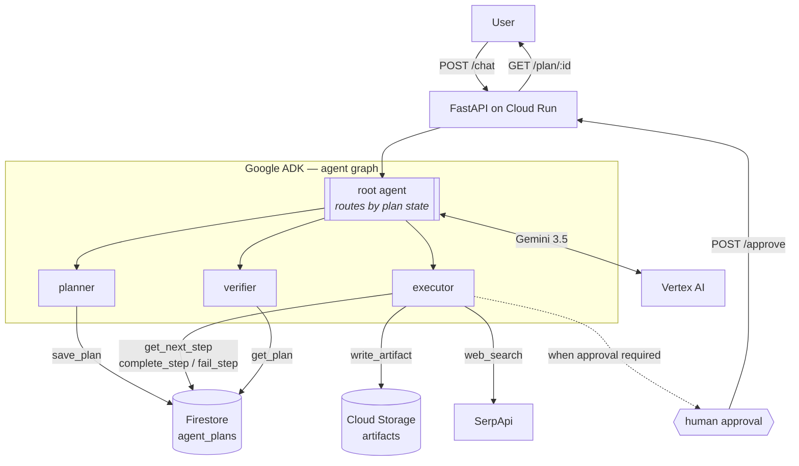

# Architecture

The rules require a system architecture diagram in the repo. This is it — keep it
current, because it is also the clearest 20 seconds of the demo video.

## The idea in one line

The plan is data in Firestore, not state hidden in the model's context. That single
choice is what makes the run resumable, auditable, and watchable on screen.

## Why it is shaped this way

**One step per turn.** The executor runs exactly one step and returns. It would be
simpler to loop inside a single invocation, but then the run is a black box: you
cannot interrupt it, resume it after a Cloud Run instance recycles, or show a judge
the plan advancing. The turn boundary *is* the feature.

**The plan is checkable data.** Every step carries a state and a recorded result.
The verifier reads those results rather than the conversation, so "the agent said it
worked" and "the step recorded evidence that it worked" stay distinguishable — which
is the failure mode that sinks agent demos.

**Side effects are typed.** `Step.side_effecting` is set at planning time, before
anything runs. With `AGENT_REQUIRE_APPROVAL=on` those steps block on a human. This is
the only difference between the two track framings.

**One cloud seam.** `stores.py` is the only module that imports a Google Cloud SDK,
and `ports.py` defines what a store must do. Porting to AWS Strands for
[Agents for Humans](../../04-agents-for-humans/README.md) means writing a
`DynamoPlanStore`, not rewriting the agent.

## Track mapping

| Track | Config | What changes |
|---|---|---|
| Taskmaster | `AGENT_REQUIRE_APPROVAL=false` | Agent runs the plan to completion |
| Collaborative Partner | `AGENT_REQUIRE_APPROVAL=true` | Blocks on side-effecting steps, resumes via `/approve` |
| Fortified Enterprise Fleet | not scaffolded | Would need per-tenant isolation, audit export, IAM-scoped tool access |

Pick one before recording. The rules require a single category and reassign
submissions that hedge.

## Reuse map

| Piece | All Things Agentic | Agentic Cinema | DevNetwork |
|---|---|---|---|
| `agent.py` planner/executor/verifier | core | same | same |
| `stores.py` Firestore + GCS | required | required | fine |
| `tools/research.py` SerpApi | optional | optional | **is** the SerpApi challenge |
| Partner tool (IBM / Grafana / ClickHouse / Parallel / Replit) | — | **required, called in code** | — |
| Domain / document tools | — | — | name.com, Nutrient, Foxit briefs |

The submissions must be substantially different projects, not one project entered
three times — see the note in the parent README.
