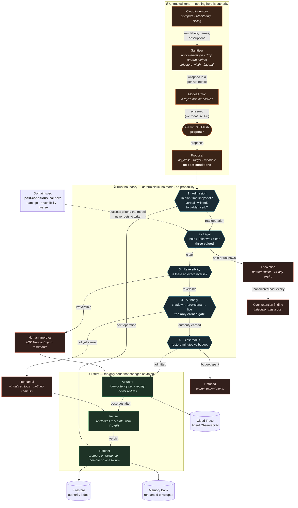

# Architecture

Geminga reclaims wasted cloud spend by actually deleting things, and earns the right to
do so one operation at a time.

The diagram's job is to make one thing obvious: **the model sits inside the untrusted
zone.** Everything it reads is attacker-influenceable, everything it emits is a
proposal rather than a decision, and the trust boundary is a wall of deterministic
checks between it and anything that can change the world.

---

## The system

---

## Why five gates and not one

The field treats "may the agent act?" as a single question. It is five, and each has a
different source of truth, a different failure mode, and a different right of appeal.
Conflating them is why almost every entrant arrives at the same defensive posture — the
agent proposes, a human executes — which surrenders the operational utility that makes
an agent worth building.

| # | Question | Authority | Nature | If it fails |
|---|---|---|---|---|
| 1 | Is this a real, permitted operation? | Plan-time snapshot + verb allowlist | Deterministic | Refuse |
| 2 | **May** it be deleted at all? | Hold register, provider primitives | **Three-valued** | Escalate, with a clock |
| 3 | Can it be undone? | Domain spec | Static property | Human approval |
| 4 | Do we believe it will work? | The ladder | **Earned, mutable** | Rehearse in shadow |
| 5 | How bad if we are wrong? | Restore-minute budget | Consumable | Refuse until the window rolls |

**Only gate 4 is earned.** That distinction carries the design: a system in which
everything is a confidence score has no way to express *no amount of evidence makes
this permitted*.

### Gate 1 — admission assumes injection succeeded

LogJack (arXiv 2604.15368, 2026) benchmarked injection payloads embedded in cloud logs
and operational text: **Model Armor detected 0 of 32**, Azure Prompt Shield 1 of 32,
Bedrock does not inspect tool results at all — while all of them catch the same
payloads as bare text. Operational formatting is the camouflage.

So detection is the wrong layer. Admission assumes the model was hijacked and makes it
useless: a proposal must name a target present in the **plan-time snapshot**, carry a
verb allowlisted for that resource type, and avoid verbs absent from the vocabulary
entirely (`iam.*`, `setMetadata`, `projects.delete`).

The resulting claim is true rather than hopeful — but it needs its scope attached, and
[CLAIMS.md](../CLAIMS.md) carries it: *no injected instruction can cause a tool call
**outside the policy***. It says nothing about harm achievable *inside* it. AgentDojo
measures that gap directly — in **17% of its security test cases the tools required to
solve the user's task are also sufficient to carry out the attack** — and CaMeL's
authors predict ROP-style chaining of individually-permitted calls against their own
design. Stopping `ml-train-01` is inside our allowlist; if that VM is load-bearing, the
allowlist did not save anyone. What limits it is the gates *after* admission, and that
is mitigation rather than immunity.

### Gate 2 — blocking is also illegal

An absolute veto builds the opposite violation. GDPR Art. 5(1)(e) is storage
limitation; CNIL fined Free €42m on that ground in January 2026. So **BLOCK means
escalate to a named owner with an expiry**, and an unanswered escalation resurfaces as
an over-retention finding.

Three-valued because absence of a signal proves nothing here: buckets have Bucket Lock,
`temporaryHold` and soft delete, while **disks and snapshots have no hold primitive at
all** — and they are what this agent most wants to delete. `UNKNOWN` never decays into
`CLEAR` through silence.

### Gate 3 — irreversibility is not a confidence level

The ladder governs doubt. It never governs consequence. An irreversible operation stays
behind a human at every rung, however much authority its class has accrued.

### Gate 4 — the ratchet

Every operation class starts in **shadow**, rehearsed against virtualised tools with
nothing committed. It reaches **provisional** after five consecutive runs where a
verifier that re-derives real environment state agrees with the prediction, then
**live** after ten more. One disagreement demotes it and resets the streak.

Trust is per *shape of work*, not per tool: authority earned deleting scratch resources
does not transfer to production ones, and an unrehearsed argument shape routes back to
shadow.

### Gate 5 — restore-minutes

Blast radius measured in how long it takes to reach an equivalent working state — the
only unit in which a wrong deletion and a wrong resize are commensurable. Unrecoverable
operations have no finite restore time, so no budget admits them at any size;
irreversibility and budget turn out to be one gate seen twice.

---

## Why the ADK 2 graph runtime

`BaseAgent` subclasses `BaseNode` in ADK 2.0 (GA 19 May 2026) — the runtime is a graph
scheduler, not a tree walker, and the audit rates it extremely underused.

- **Schemas are checked across edges at construction**, so a type error fails before any
  model call and before any money is spent.
- **`retry_config` and `timeout` live on the node**, so failure handling is declared in
  the topology rather than buried in try/except. This matters twice over: a broad
  `except` inside a node silently defeats both the retry machinery and the
  human-in-the-loop pause.
- **Cycles are legal** when they contain a routed edge, so "next operation" is an edge
  in the graph rather than a Python `while` — drawable, replayable, interruptible.
- **The engine is LLM-free**, which is what lets the whole ladder run deterministically
  in CI and be filmed in one unbroken take.

Deployment is Cloud Run, not GKE — the Fleet toolkit names Agent Runtime, and Google's
own multi-tenant agentic reference architecture uses Agent Runtime with a Cloud Run
frontend. See [DECISIONS.md](../DECISIONS.md) D-007.

---

## This is Google's own doctrine, rediscovered

Worth stating plainly, because it is stronger than novelty: almost every mechanism
here has a name at Google already, and we should use theirs.

| Ours | Google's | Source |
|---|---|---|
| Deterministic gates around a model | **Policy engines** — "dependable, deterministic security mechanisms… that operate outside the AI model's reasoning process… acting as security chokepoints" | *An Introduction to Google's Approach to AI Agent Security* (Díaz, Kern, Olive, 2025) |
| allow / escalate / human-approve | **allow / block / require user confirmation** — keyed on "the action's inherent risk (**Is it irreversible?**)" | ibid. |
| Verifier never actuates | **Canary Analysis Service** — "a purely passive observer: it never changes any part of the production system" | Davidovič & Beyer, *ACM Queue* 2018 |
| Binary agree/disagree, no score | CAS "intentionally does not provide a confidence score, p-value, or the like: that would imply that the rollout tool has logic to determine when to take a real-world action" | ibid. |
| Damage budget halts work | **Error budget** — "as long as there is error budget remaining, new releases can be pushed"; exhaustion triggers a production freeze | SRE Book |
| Human gate on irreversible deletion | "For actions deemed critical or irreversible — such as **deleting large amounts of data** — the system should require explicit human confirmation" | Google agent security paper; echoed in SAIF 2.0 |

Google's own paper states our central thesis outright: *"neither purely rule-based
systems nor purely AI-based judgment are sufficient on their own"*, and reasoning-based
defences "**must** work in concert with deterministic controls."

And the SRE Book's chapter on automation contains Google's postmortem of a system that
deleted disks fleet-wide because "the empty set was used as a special value,
interpreted to mean 'everything'." **The shadow rung is the remediation Google wrote
down in 2016**, applied to an agent instead of a script.

What is genuinely ours, and flagged as such: the *k*-consecutive promotion rule (Google
canaries in stages but publishes no k-of-k criterion), restore-minutes as a unit
(anchor to MTTR), and evidence-accumulating authority held **per operation class** —
an error budget and a canary applied to the agent's own permission rather than to a
release.

## Platform components

| Component | Use | State |
|---|---|---|
| Gemini 3.6 Flash (Vertex, `global`) | The proposer | ✅ live |
| ADK 2.6.3 graph runtime | The whole pipeline | ✅ live |
| Firestore | Authority ledger, durable across restarts | ✅ verified |
| Cloud Storage | Artifacts | ✅ |
| Cloud Run | Console and agent | ⬚ built, not deployed |
| Model Armor | Perception screen | ⬚ API available |
| Agent Registry | A2A agent card | ⬚ API available |
| Memory Bank | Rehearsed-shape envelopes | ⬚ |
| Agent Identity | Scoped delete rights | ⬚ **containment is currently an intention** |
| Agent Observability | OTel → Cloud Trace | ⬚ |

Verified by execution, without credentials: graph construction and validation, the full
ladder across runs, fault-injection demotion, idempotent replay, 20/20 refusals.
Verified with credentials: live Gemini proposal inside the graph, Firestore round-trip,
real deletion of a real resource.

Not verified: any Cloud Run deployment. `ResumabilityConfig` is marked experimental by
ADK. Cost figures are list-price estimates, not billing data.

See [RESTRAINT.md](../RESTRAINT.md) for what the system refuses to do and how that is
measured, and [SCAFFOLD-COMPARISON.md](SCAFFOLD-COMPARISON.md) for the v1 baseline this
replaced.
